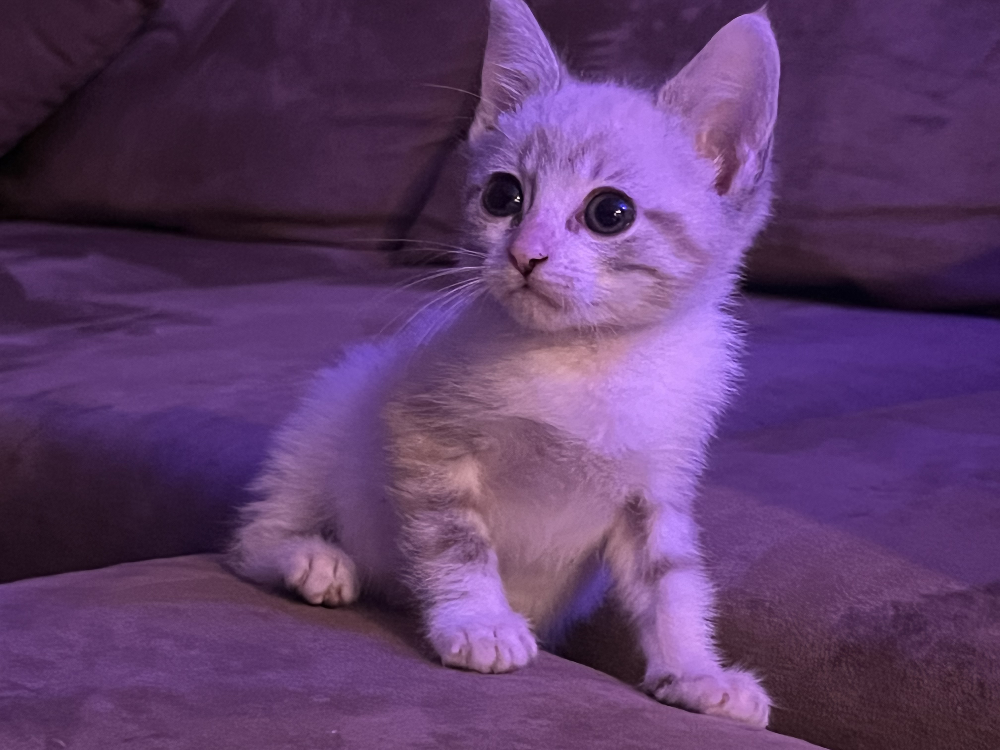

# Jake's User Page

click [here](https://jarnke.github.io/CSE110Lab0#saved-the-best-for-last) to skip to the best part...
or click [here](./README.md) to jump back to the README page.

## Hello!
#### A little about me:

I'm a third year studying Computer Science at UCSD, currently living in Irvine.  I've always been interested in creating, whether that be through art or engineering or something in between.  

>The middle ground is where I believe programming often lies and that's what I find so fascinating about it.

#### Hobbies
- Skateboarding
- Programming
- Gaming
- Video Editing
    - [Youtube](https://www.youtube.com/channel/UCTL3tAykF16-lSBUyl4Iz-A)
  

#### Programming is *_fun_*!

```c++
while(true){
    cout << "Help!" << endl
}
```
Whoops, I forgot a semicolon :/

#### My understanding of programming:

- [x] Low level stuff, /(C/ARM)
- [X] Basic Hardware /(SystemVerilog)
- [X] Data Structures and Algorithms
- [ ] Literally anything related to Web Development, UI, or Apps...

#### Saved the best for last:

Check out my adorable kitten :)



#### But wait there's more!

I realized I still haven't used an ordered list so here are my favorite things in order:

1. Sleeping
2. Eating
3. Napping
4. ?


